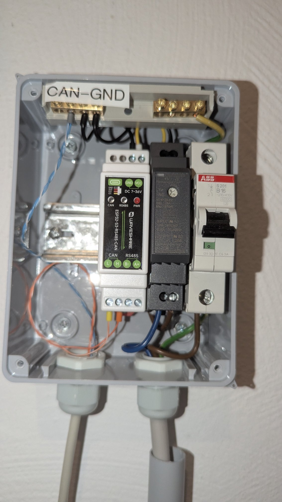
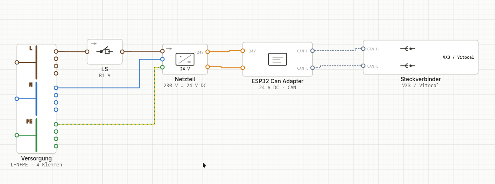
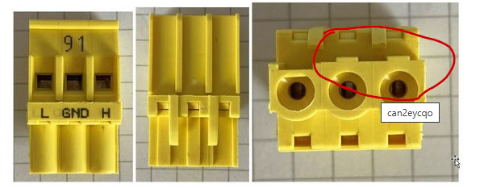
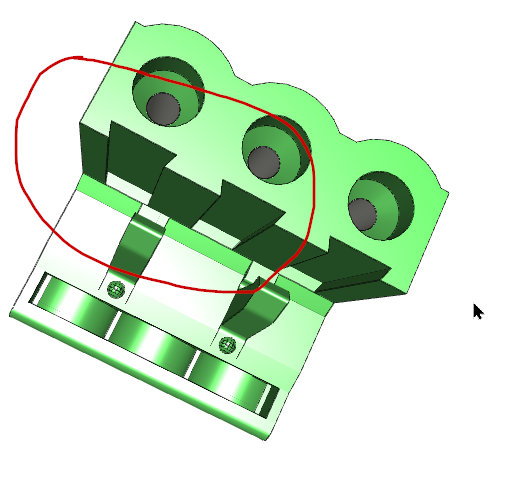
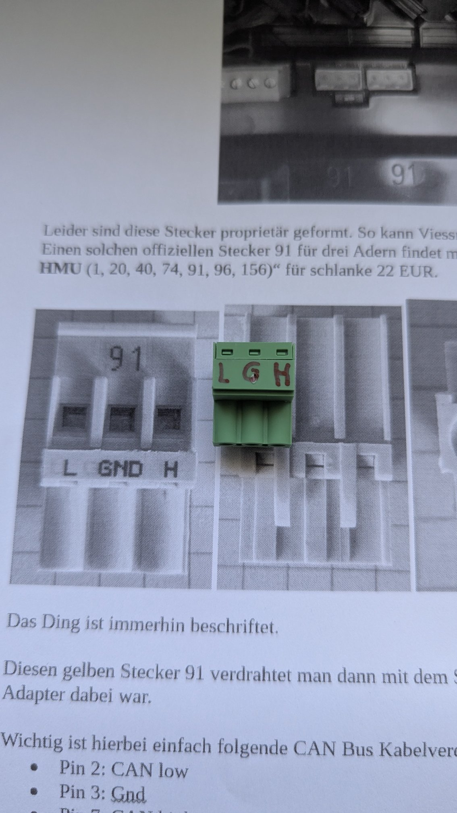
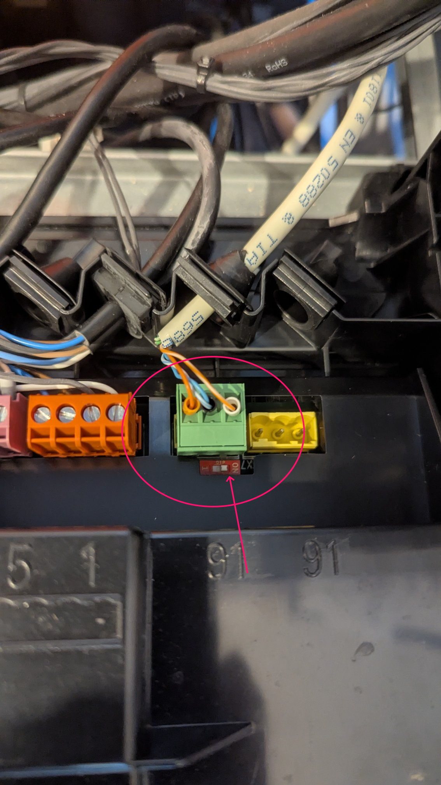
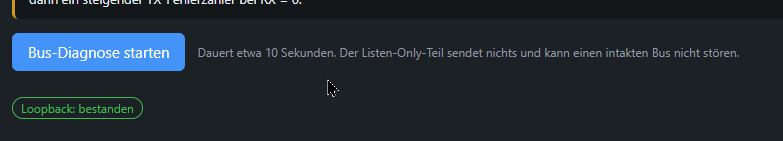
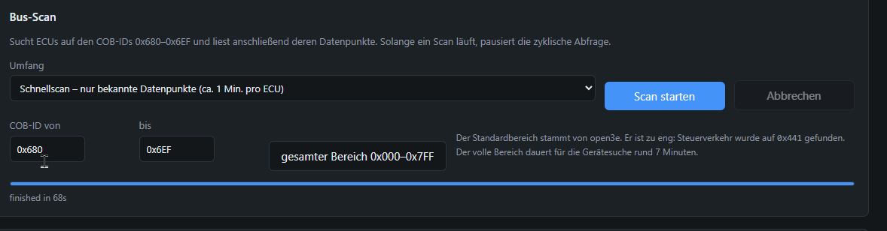
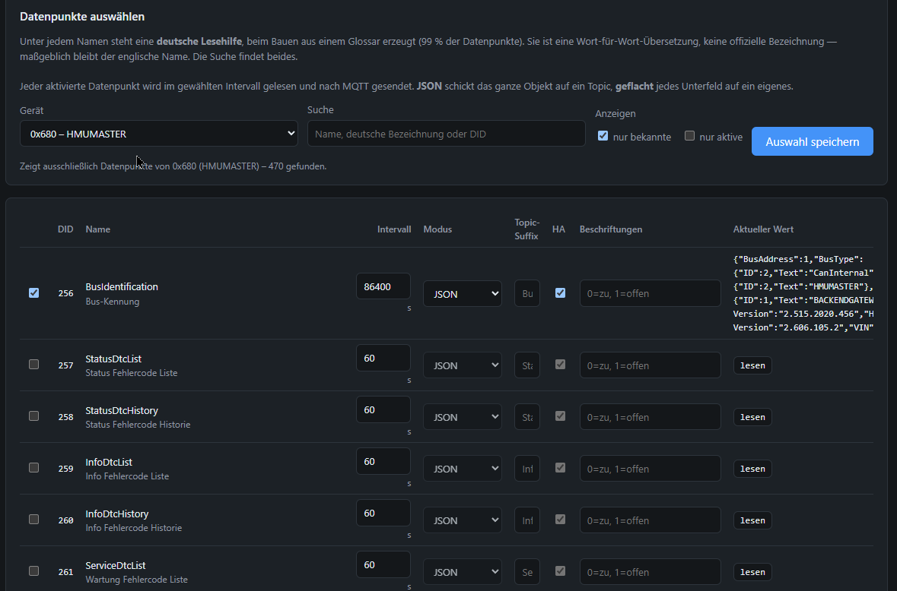
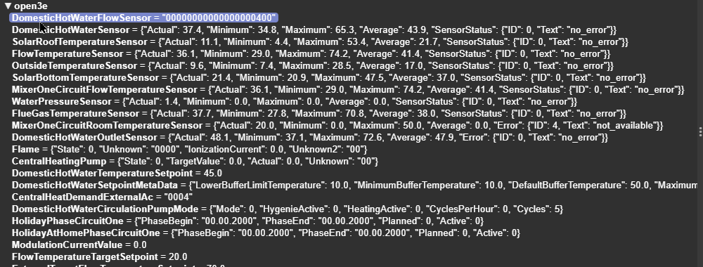

# Aufbau in der Praxis: Waveshare-Modul an einer Vitodens

Ein Erfahrungsbericht von **wunderbaum** aus der
[open3e-Diskussion #386](https://github.com/open3e/open3e/discussions/386),
hier gesammelt, weil er das beschreibt, was in der README nur als Regel
steht: wie man das Ding tatsächlich an die Heizung bekommt. Die Anlage ist
eine Vitodens 343-F B3UG-19, eine Brennwerttherme für Fußbodenheizung mit
Solarthermie fürs Brauchwasser. Die Fotos stammen von ihm.

Was hier steht, ergänzt die beiden anderen Artikel und wiederholt sie nicht:
die technische Einordnung in [open3e-wiki.md](open3e-wiki.md), die
Verkabelungsregeln (Masse, Abschluss, Spannung) in der
[README](../README.md#hardware).

## Was gebraucht wird

| Teil | Beispiel | Anmerkung |
|---|---|---|
| Waveshare ESP32-S3-RS485-CAN | ca. 20 € bei Waveshare, ca. 30 € mit Tageslieferung bei Amazon | das Board, auf das diese Firmware zugeschnitten ist |
| Hutschienennetzteil | Mean Well HDR-15-12 | 12 V reichen, das Board nimmt 7 bis 36 V |
| Leitungsschutzschalter | B6 oder B16, einpolig | der guten Ordnung halber vor dem Netzteil |
| Kleine Unterverteilung aus Kunststoff | Aufputz, 4 bis 6 TE | Kunststoff, sonst funkt das WLAN nicht heraus |
| Stecker für Buchse 91 | Phoenix Contact MSTB 2,5/3-ST-5,08 | siehe unten, das Original ist unverhältnismäßig teuer |
| Verdrahtung | ein Rest Patchkabel | verdrilltes Paar für CAN-H/CAN-L |

Zur Unterverteilung eine Warnung aus Erfahrung: bei der verwendeten waren
die Schrauben der eingebauten Klemmleisten aus einer sehr weichen Legierung
und ab Werk so fest angezogen, dass man sie kaum ohne Schaden herausbekommt.
Beim Kauf auf brauchbare Klemmen achten.

## Vorher flashen

Das Board am PC flashen, bevor es eingebaut wird. Im Browser geht das über
<https://esp32can.thomas-peterson.de>, danach WLAN über den Hotspot
einrichten. Steckt das Board erst einmal in der Verteilung neben der Heizung,
ist der USB-Anschluss schlecht erreichbar; Updates gehen danach per OTA aus
der Weboberfläche.

## Der Aufbau

Von links nach rechts: das Waveshare-Modul, das Hutschienennetzteil, der
Leitungsschutzschalter. Die Stromversorgung für das Netzteil kommt vom
Anschlusskasten der Heizung. Oben die beiden Klemmleisten der Verteilung,
die linke ist als **CAN-GND** beschriftet.

Wie in der README beschrieben muss die Busmasse mit der Board-Masse verbunden
werden. Das erledigt hier die linke Klemmleiste: dort treffen sich GND des
Boards, der Minuspol des Netzteils und die GND-Ader zum Stecker 91. Verdrahtet
ist alles mit einem Rest Patchkabel. Für die GND-Verbindung wurden zwei Adern
genommen, für CAN-L und CAN-H eines der verdrillten Paare, hier orange und
orange-weiß.

Als Schaltbild:

## Der gelbe Stecker 91

Der CAN-Anschluss der Heizung ist die gelbe Buchse **91** unter der Haube,
beschriftet mit **L, GND, H**. Viessmann verkauft den passenden Stecker nur
im Paket mit sechs anderen, für rund 22 €. Für einen einzelnen Stecker reicht
ein handelsüblicher Leiterplattensteckverbinder im Raster 5,08 mm mit drei
Polen:

- Phoenix Contact [MSTB 2,5/3-ST-5,08](https://www.phoenixcontact.com/de-de/produkte/leiterplattenstecker-mstb-25-3-st-508-1757022)
  (passt, mit Firmenadresse gibt es dort auch Muster)
- vermutlich ebenso der [von Reichelt](https://www.reichelt.de/de/de/shop/produkt/steckbare_schraubklemme_-_3-pol_rm_5_mm_0_-292638),
  ungetestet

| Original | Phoenix Contact |
|---|---|
|  |  |

Dem Phoenix-Stecker fehlen nur die Erhöhungen, wo der Originalstecker
Vertiefungen hat. Er passt ohne Nacharbeit, nichts muss gefeilt werden. Die
Führungsschienen passen nicht hundertprozentig, weil beim gelben Stecker eine
davon gefüllt ist, der Stecker sitzt trotzdem sehr fest. Die Beschriftung muss
man selbst anbringen:

Das Schwarzweißbild darunter ist der Ausdruck eines PDFs aus dem
Viessmann-Forum, das den Originalstecker zeigt. Der grüne Stecker liegt zum
Vergleich darauf.

## Abschlusswiderstand

Hängt sonst nichts weiter am CAN-Bus der Heizung, muss der kleine Schalter auf
dem Board auf **ON** stehen, das Gerät sitzt dann am Busende. Hängen schon
andere Teilnehmer daran, bitte den Abschnitt zum Abschluss in der README
lesen: zwei Abschlüsse zu viel legen den Bus lahm.

## Inbetriebnahme

Ist alles verdrahtet, zuerst in der Weboberfläche die **Busdiagnose**
drücken:

Zeigt sie Fehler, stimmt die Verkabelung noch nicht, meist die Masse oder der
Abschluss. Erst dann den **Bus-Scan** auf dem Reiter *System* starten; er
dauert einige Minuten:

Danach, sofern MQTT konfiguriert ist, die Datenpunkte auswählen, die in Home
Assistant erscheinen sollen:

Hier nicht übertreiben. Voreingestellt wird jeder gewählte Datenpunkt alle
60 Sekunden abgefragt. Bei Werten, die sich nie ändern, etwa der
Bus-Identifikation, reicht einmal am Tag; das Intervall lässt sich je
Datenpunkt setzen.

*Auswahl speichern* veröffentlicht die Datenpunkte per MQTT, nachprüfbar etwa
mit dem MQTT Explorer:

Dank Auto-Discovery tauchen sie dann auch in Home Assistant auf. Schreiben
ist in der Firmware voreingestellt gesperrt; wer Datenpunkte setzen will,
gibt es in den Einstellungen frei, siehe README.
